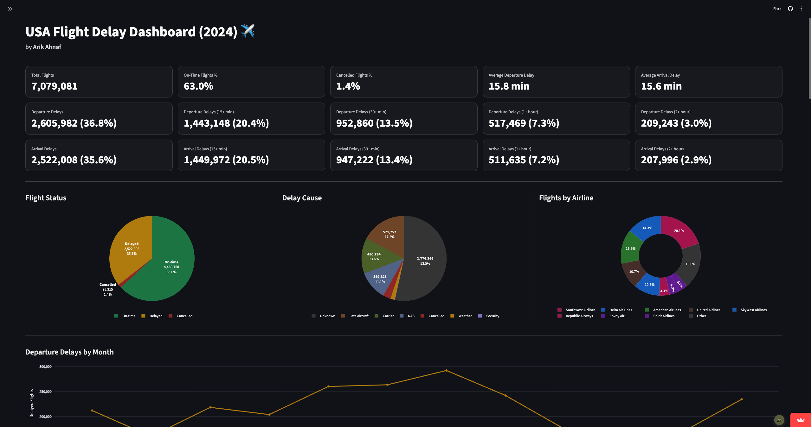
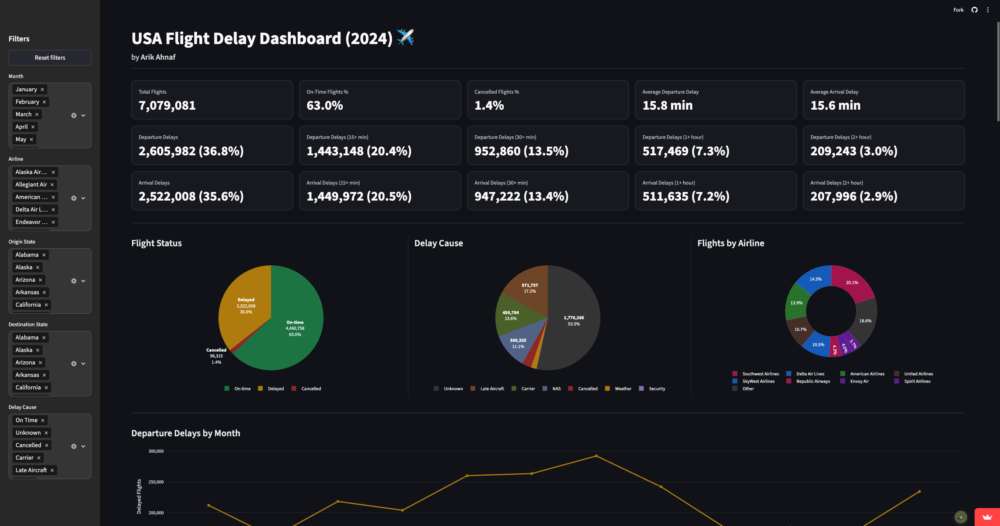
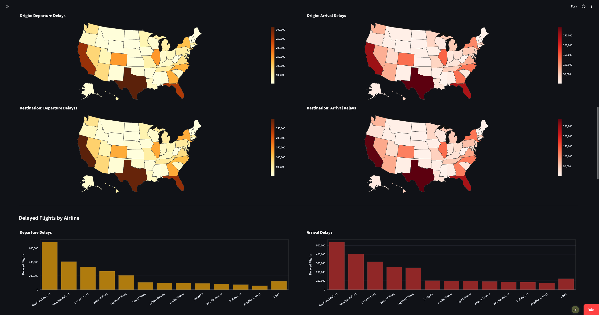
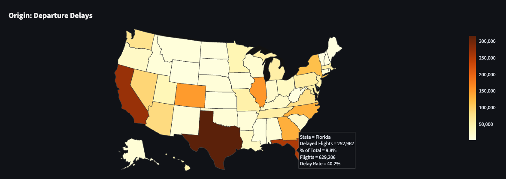

# USA Flight Delay Analytics (2024) ✈️

This project analyzes U.S. flight delay data from **2024** to uncover trends in airline performance, airport congestion, and delay causes. The final output is an interactive **Streamlit** + **Plotly** dashboard designed for clear business and operational insights.

### 🔗 Live Dashboard

[usa-flight-delay-dashboard-2024.streamlit.app](https://usa-flight-delay-dashboard-2024.streamlit.app)

---

## ❓ Key Questions Answered

- Which **airlines** have the highest **delay rates**?
- Which **states** experience the **worst delays**?
- How do delays vary by **month**?
- What are the primary **causes of delays**?
- How often do **long delays** occur (**15+**, **30+**, **60+**, and **120+** **minutes**)?

---

## 📊 Visualizations & Features

- **KPI** single-valued cards
- **Pie** & **donut** charts
- **Line charts** of delayed flights by month
- **Choropleth maps** of USA
- **Bar charts** of delayed flights by airline
- Monthly summary & scorecard **tables**
- **Filter** sidebar (Month, Airline, Origin/Destination State, Delay Cause)

---

## 📸 Screenshots

### Dashboard landing page


&nbsp;

### Dashboard view with filters sidebar open


&nbsp;

### Choropleth maps and vertical bars view


&nbsp;

### Tooltips on hover



---

## ❗️ Troubleshoot

#### App may be sleeping (happens with Streamlit free tier).

To fix: Click "Yes, get this app back up!" button, then wait a few seconds for it to restart.


---

## 🛠️ Tools Used

- **Python** (Pandas, NumPy)
- **Jupyter Notebook**
- **Streamlit** + **Plotly**
- **Kaggle Dataset**

---

## 🧪 ETL Pipeline Workflow

This project is built around a repeatable ETL (Extract, Transform, Load) pipeline to produce dashboard-ready datasets from the raw Kaggle CSV.

### Extract

- The raw dataset is sourced from Kaggle (**Flight Data 2024**) and stored locally in:
  - `data/raw/flight_data_2024.csv` (full dataset)
  - `data/raw/flight_data_2024_sample.csv` (small sample used for development/testing)

### Transform

- The `notebooks/data_processing.ipynb` notebook documents the data preparation logic and validates the pipeline using the sample dataset. Key steps include:

  - Renaming column headers to business-friendly names
  - Dropping unnecessary operational fields to improve performance
  - Correcting data types (e.g., parsing `flight_date`, cleaning numeric delay fields)
  - Engineering dashboard-ready features such as:
    - `is_delayed_15` (standard delay flag: arrival delay > 15 minutes)
    - `delay_bucket` (binned delay severity)
    - `primary_delay_cause` (dominant delay reason for breakdowns)
    - calendar fields (month name, day-of-week, week-of-year)
    - scheduled departure hour for time-of-day analysis
    - state abbreviations for USA mapping (`origin_state_abbr`)

- The full dataset (~1.2GB) is processed using a chunk-based script:
  - `scripts/process_flight_data_in_chunks.py`  
    This avoids loading the entire file into memory and reliably generates the full cleaned dataset locally.

### Load

- The final cleaned dataset (generated locally) is saved as:

  - `data/processed/flight_clean_data_2024.csv`

- For hosting and fast dashboard performance, small aggregated tables are generated and stored in:
  - `data/processed/dashboard/`

These aggregated tables are used by the hosted Streamlit app.

---

## 📦 How to Run

### 1. Clone the Repository

```bash
git clone https://github.com/arikahnaf/usa-flight-delay-analytics-2024.git
cd usa-flight-delay-analytics-2024
```

### 2. Setup Environment

```bash
python3 -m venv .venv
source .venv/bin/activate
pip install -r requirements.txt
```

### 3. Process the full dataset

Download the Kaggle dataset and place the csv here:

- `data/raw/flight_data_2024.csv`

Then run:

```bash
python scripts/process_flight_data_in_chunks.py \
  --raw data/raw/flight_data_2024.csv \
  --out data/processed/flight_clean_data_2024.csv \
  --chunksize 500000
```

### 3. Run the dashboard

```bash
streamlit run app/app.py
```

---

## 📂 Project Structure

```
usa-flight-delay-analytics-2024/
├── app/                                      # Streamlit dashboard
├── assets/                                   # Screenshots of dashboard
├── data/
│   ├── processed/
│       ├── flight_clean_data_2024_sample.csv # Processed sample output
│       └── dashboard/                        # Aggregated tables for hosting
│   └── raw/
│       ├── flight_data_2024_sample.csv       # Raw sample dataset
│       └── flight_data_2024.csv              # Full raw dataset (not included due to size)
├── notebooks/                                # Data preparation workflow
├── scripts/                                  # Scripts for processing datasets
├── tableau/                                  # Workbook containing the dashboard
└── requirements.txt                          # Dependencies
```

---

## 📚 Kaggle Dataset

https://www.kaggle.com/datasets/hrishitpatil/flight-data-2024

⚠️ The dataset is **not included** in this repository due to size constraints.
